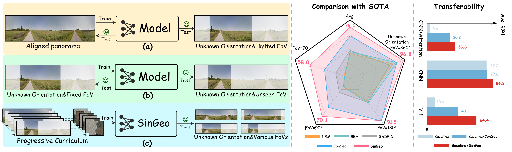

# SinGeo
The official implementation of "SinGeo: Unlock Single Model’s Potential for Robust Cross-View Geo-Localization", accepted at CVPR 2026 as Highlight! You can access the paper [Here](https://arxiv.org/abs/2603.09377)

## Introduction

SinGeo tries to deliver a paradigm shift to learning a single model for robust CVGL via effective combination of proposed dual discriminative learning and curriculum-guided progressive training.



## Environments

Required environments:
- Linux
- Python 3.7+
- PyTorch 1.10.0+
- CUDA 9.2+
- GCC 5+

Please use the following commands to prepare the environment.
```
git clone https://github.com/Yangchen-nudt/SinGeo.git
cd SinGeo
pip install -r requirements.txt
```

## Training:
We provide codes for training on 4 datasets (CVUSA/CVACT/VIGOR/University-1652), and take the CVUSA for example.

- Set the path in [dataset](singeo/dataset/cvusa.py), [training](train_singeo_cvusa.py), [distance_calc](calc_distance_cvusa.py).
- Execute the calc_distance_cvusa script:
```
python calc_distance_cvusa.py
``` 
- [Optional] Download the pretrained model weights, and set the model path in [model](singeo/model.py)
- Train the model by running:
```
python train_singeo_cvusa.py
```
- Evaluate the trained model by running:
```
python eval_cvusa.py
```

Note:
- Change the "fov" configuration in the training&evaluating code to change evaluation settings:
```
0.0: north-aligned, value from (70.0, 90.0, 180.0): limited FoV, 360.0: arbitrary orientations
```
- Change the "fov_start"/"fov_end", "min_prob"/"max_prob" in the training code to adjust the curriculum setting.

## Rank-N-Contrast (RNC) auxiliary loss

An optional [Rank-N-Contrast](https://arxiv.org/abs/2210.01189) objective can be
added on top of the six InfoNCE terms. It is **off by default** and never
replaces the existing losses — set `use_rnc = True` in
[train_singeo_cvusa.py](train_singeo_cvusa.py) to enable it.

Where InfoNCE only knows *same location* vs *different location*, RNC needs a
continuous distance between every pair of views, and ranks each reference
against all references at least as far away. Everything below is about where
that distance comes from.

### Positive pairs: distance from FoV overlap

Every view is reduced to an **arc on the azimuth circle** — the range of real-world
directions it can actually see:

| View | Arc |
|---|---|
| `q1` full panorama | 360° |
| `q2` ground FoV crop | `extent` degrees at the orientation the crop was drawn at |
| `r1` full aerial tile | 360° |
| `r2` aerial sector crop | the wedge that survived, in world azimuth |

For two views of the **same** location the distance is the angular IoU of their
two arcs, turned into a distance and compressed into the lower half of the range:

```
dist = rnc_positive_scale * (1 - angular_IoU)      # in [0, 0.5]
```

Two full views land at exactly 0; a 90° crop against its own panorama shares
90/360, so `dist = 0.5 * (1 - 0.25) = 0.375`. This applies to the cross-domain
(ground↔aerial) relation and to both same-domain relations alike.

Because the crop window is what gets labelled, the FoV crop **moves out of the
albumentations pipeline and into the dataset** when RNC is on:
`LimitedFoV` draws its own orientation and discards it, which makes the resulting
view impossible to label. `apply_limited_fov` in
[singeo/transforms.py](singeo/transforms.py) performs the identical operation and
returns the window alongside the image; the dataset records it in the `meta`
tensor it emits when built with `return_meta=True`.

### Negative pairs: geography, not model state

Pairs from **different** locations are tiered by `negative_tiering`, and always
land strictly above every positive distance. That separation is load-bearing: if
a negative could reach into the positive range, the "all refs at least this far
away" rank set would mix same-location and different-location pairs and the
ranking would stop meaning anything.

| Mode | Distance source | Stable across training? |
|---|---|---|
| `"geo"` *(default)* | Geographic proximity, read from the pre-computed neighbour ranking (`gps_dict_path`, built by `calc_distance_cvusa.py`) | Yes |
| `"none"` | Flat 1.0 for every negative — original untiered RnC, and the ablation baseline | Yes |
| `"dss"` | The model's current embedding similarity — **experimental** | No |

**The DSS-independence rule.** In `"geo"` and `"none"` modes the negative
distance must not derive from embedding similarity, the model's current
predictions, or any output of the Dynamic Similarity Sampling / hard-negative
mining code. DSS and the distance labeller do two different jobs:

- **DSS** (`CVUSADatasetTrainSinGeo.shuffle`) decides *which* negatives enter a batch.
- **`NegativeDistanceTiering`** (in [singeo/distances.py](singeo/distances.py)) decides *what distance label* a negative carries once it is there.

Wiring the first into the second would make the ranking target chase the model's
own confusion — a moving, self-referential objective that asks the model to
*preserve*, at convergence, exactly the confusability the discriminative loss and
DSS's hard mining are working to remove. The two stay separate objects in the
code, and this is flagged in a comment at the distance-computation site.

`"dss"` mode implements that discouraged behaviour anyway, for ablation. It
routes through the same distance-matrix interface (so switching is a one-line
config change), detaches the hardness signal from the autograd graph, and emits
a `RuntimeWarning` plus a console warning whenever it is selected. It is not the
default and should not become one.

Note that `sim_dict` in the training script starts out as the GPS neighbour
dictionary but is **overwritten by `calc_sim` with model-similarity rankings**
after the first eval. Geo tiering therefore loads the same file into its own
`GeoNeighbourRanks` structure, which nothing overwrites.

### The four groups

RNC is computed separately for four anchor→reference groups, never merged into
one matrix — same-domain and cross-domain similarities are not on a comparable
scale and must not share a softmax, matching how the existing InfoNCE terms are
also kept pairwise:

| Group | Anchors | References |
|---|---|---|
| `g2a` | ground (`q1`, `q2`) | aerial (`r1`, `r2`) |
| `g2g` | ground | ground (self-pairs masked) |
| `a2g` | aerial | ground |
| `a2a` | aerial | aerial (self-pairs masked) |

All four raw values are logged per step and averaged per epoch, so their relative
magnitudes stay visible rather than being hidden inside the weighted sum.

### Aerial crop

`enable_aerial_crop` (default `True`) adds the aerial counterpart of the ground
FoV curriculum: the tile is continuously rotated by a recorded angle and an
azimuth **sector** is kept. A plain centre crop would not work here — it keeps
every azimuth and only trims range, so it carries no angular information to
label; a wedge mirrors `LimitedFoV` exactly, and the two arcs become directly
comparable. Both the sector width and the rotation magnitude ride the existing
schedulers (`get_dynamic_fov`, `get_dynamic_rotation_angle`) rather than
introducing a second, disconnected curriculum, and the discrete ±90° rotation is
switched off in this mode so two unrelated rotations do not stack.

The sector's **heading is anchored to the ground crop's heading** and then
allowed to drift off it:

```python
deviation = uniform(-sat_rot_max, +sat_rot_max)     # sat_rot_max widens per epoch
s_center  = (g_center + deviation) % 360
```

Drawing `s_center` uniformly instead would hand the model fully decorrelated
cross-view pairs from epoch 1 and flatten the curriculum. Anchoring makes early
epochs pair the aerial sector with roughly the scene the ground view is looking
at, and later epochs let the two point in unrelated directions:

| Epoch | ground FoV | aerial sector | drift bound | `q2`–`r2` overlap |
|---|---|---|---|---|
| 1 | 352.8° | 354° | ±4.5° | 0.976 – 0.987 |
| 20 | 215° | 240° | ±90° | 0.458 – 0.753 |
| 40 | 70° | 120° | ±180° | 0.000 – 0.551 |

The labels need no special handling for this: they are computed from the
recorded arcs, so they follow the drift automatically.

The wedge is masked to the tile's inscribed circle (`circular_mask=True`),
matching the `CircularMask` behaviour of the existing continuous-rotation
pipeline, and the tile is rotated in place so `r2` keeps exactly `r1`'s scale.

### Dropout on the cropped views

`crop_dropout_strength` (default `0.5`) scales the GridDropout/CoarseDropout
severity on `q2` and `r2` only — the two views that are *also* being cropped.
`1.0` restores the original SinGeo settings, `0.0` removes dropout from those
views. The uncropped `q1` / `r1` always keep full-strength augmentation.

The two views have already lost most of their content to the FoV crop and the
aerial sector; GridDropout at ratio 0.5 then removes half of what survives, so
the crop and the dropout compound. The knob scales the grid ratio, hole count
and hole size — deliberately **not** how often dropout fires. Folding
probability in as well makes the occluded area fall off as roughly
`strength⁴`, so an apparently mild 0.35 becomes an off-switch:

| `strength` | 1.00 | 0.75 | 0.50 | 0.40 | 0.25 |
|---|---|---|---|---|---|
| `q2` ground blanked | 5.43% | 2.82% | 1.19% | 0.73% | 0.26% |
| `r2` aerial blanked | 8.28% | 4.34% | 1.46% | 0.90% | 0.22% |

With `enable_aerial_crop = False` the aerial branch only ever yields the full
tile, and the `g2a` / `a2g` / `a2a` groups collapse to using that view alone.

### Config

```python
use_rnc: bool = False                    # master switch
rnc_weight: float = 1.0                  # weight of the summed RNC term
rnc_tau: float = 2.0                     # RNC temperature
rnc_similarity: str = "cosine"           # "cosine" | "l2"
rnc_group_weights: tuple = (1.0, 1.0, 1.0, 1.0)   # (g2a, g2g, a2g, a2a)
rnc_positive_scale: float = 0.5          # positives occupy [0, this]
rnc_negative_margin: float = 1e-3        # gap below the negative range
negative_tiering: str = "geo"            # "geo" | "none" | "dss"

enable_aerial_crop: bool = True
aerial_arc_start: float = 360.0          # sector width at epoch 1
aerial_arc_end: float = 120.0            # sector width at the final epoch
aerial_rot_max: float = 180.0            # max |continuous tile rotation|
```

Tests: `python tests/test_rnc.py` (or `pytest tests/test_rnc.py`).

## Acknowledgement:
We thank the authors of relevant CVGL works for their valuable code bases and benchmarks. If you find SinGeo helpful in your research, please consider citing:

```bibtex
@inproceedings{chen2026singeo,
  title={SinGeo: Unlock Single Model's Potential for Robust Cross-View Geo-Localization},
  author={Chen, Yang and Chen, Xieyuanli and Li, Junxiang and Tang, Jie and Wu, Tao},
  booktitle={Proceedings of the IEEE/CVF Conference on Computer Vision and Pattern Recognition},
  pages={19403--19412},
  year={2026}
}

@inproceedings{mi2024congeo,
  title={Congeo: Robust cross-view geo-localization across ground view variations},
  author={Mi, Li and Xu, Chang and Castillo-Navarro, Javiera and Montariol, Syrielle and Yang, Wen and Bosselut, Antoine and Tuia, Devis},
  booktitle={European Conference on Computer Vision},
  pages={214--230},
  year={2024},
  organization={Springer}
}

@inproceedings{deuser2023sample4geo,
  title={Sample4geo: Hard negative sampling for cross-view geo-localisation},
  author={Deuser, Fabian and Habel, Konrad and Oswald, Norbert},
  booktitle={Proceedings of the IEEE/CVF International Conference on Computer Vision},
  pages={16847--16856},
  year={2023}
}
```
